# 🏕️ Hack The Box Challenge: FlagCommand

> _"Embark on the Dimensional Escape Quest where you wake up in a mysterious forest maze... Will you conquer the enchanted maze or be lost forever?"_

---

## 🎯 Descripción del reto

FlagCommand es un reto tipo *web* interactivo, ambientado en una especie de terminal dentro de una historia. El objetivo es encontrar una flag escondida usando comandos ocultos en una interfaz estilo aventura de texto.

---

## 🌐 Paso 1: Acceder a la aplicación

Iniciamos la máquina y accedemos a la IP y puerto proporcionados:

```
http://83.136.252.13:47575
```

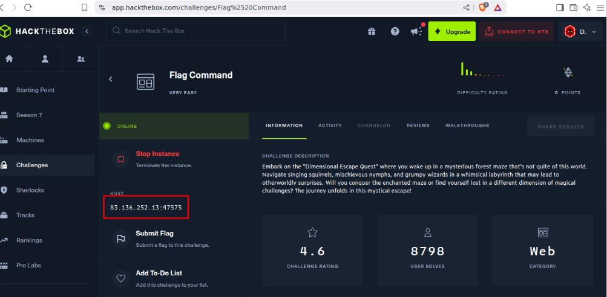


Al abrir la página, se nos presenta una interfaz con una historia de introducción y una consola interactiva en la parte inferior.

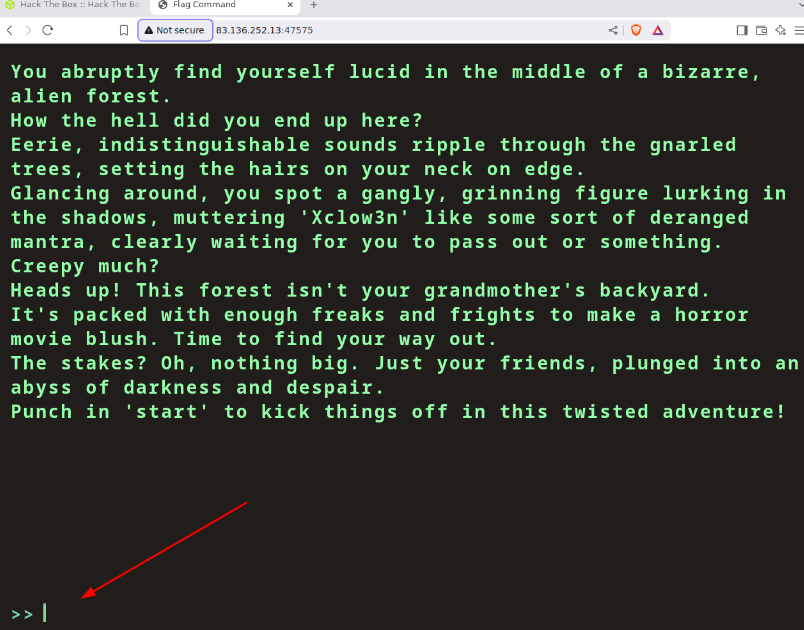

---

## 🧪 Paso 2: Pruebas iniciales

Intentamos comandos comunes como:

```
whoami
ls
$(id)
```

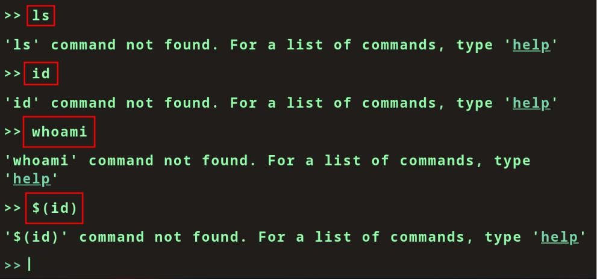

Pero la terminal responde que esos comandos no están disponibles. Usamos `help` para ver qué opciones están disponibles.

```bash
>> help
```

Se listan algunos comandos como:
- `start`
- `info`
- `clear`
- `restart`

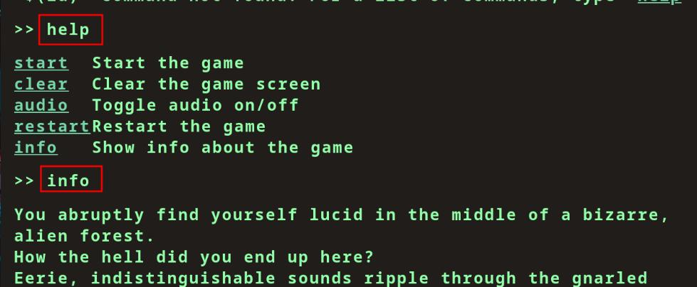

---

## 🎮 Paso 3: Iniciar el juego

Usamos `start` para comenzar la aventura:

```bash
>> start
```
El juego muestra un entorno tipo historia de texto con opciones como:

```
HEAD NORTH
HEAD SOUTH
HEAD EAST
HEAD WEST
```

Ninguna acción parece llevarnos a la flag, así que comenzamos a investigar más a fondo usando las herramientas de desarrollo del navegador.

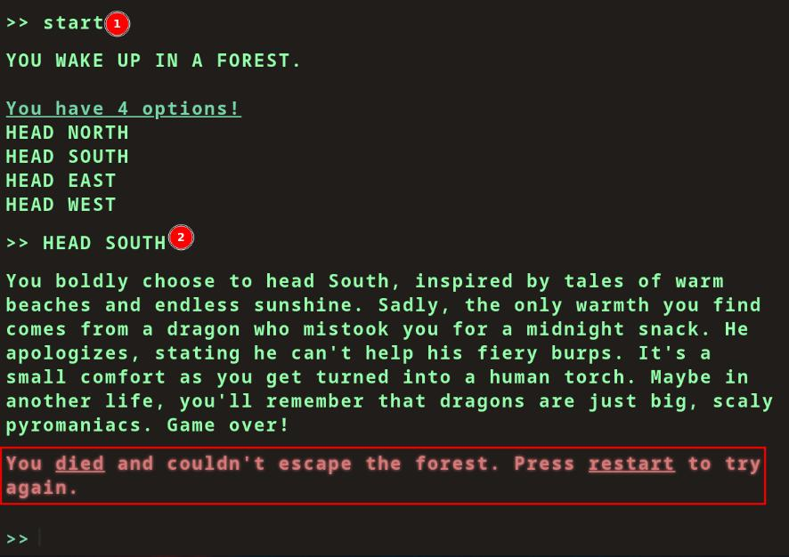

---

## 🕵️ Paso 4: Inspección con DevTools

Presionamos `F12` y revisamos las pestañas:

### 📁 **Sources:**
Vemos el código del juego y algunas constantes interesantes como `GAME_WON`, pero no contiene la flag.

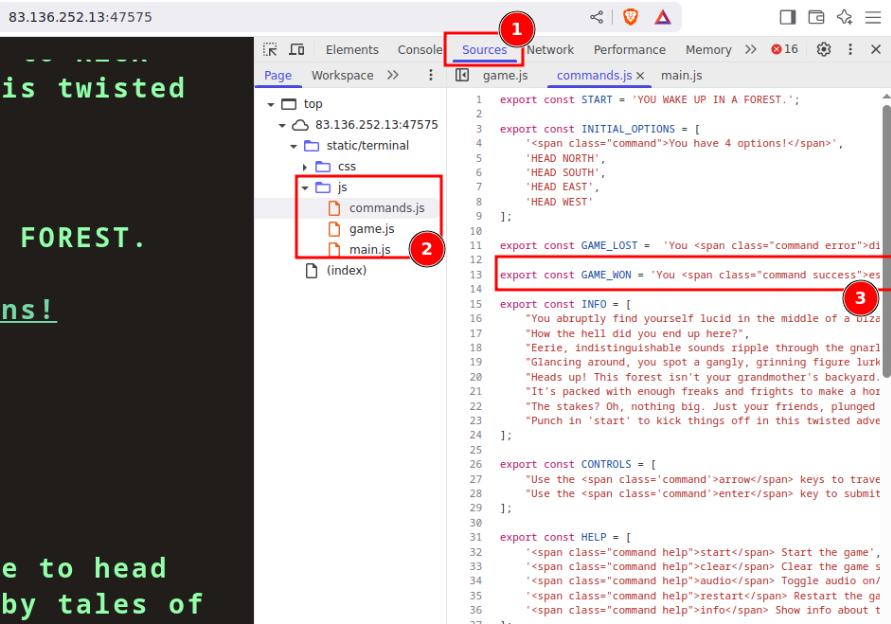

### 🌐 **Network:**
Aquí encontramos algo clave: una petición a una API `OPTIONS`, lo cual indica que hay una API que podríamos investigar.

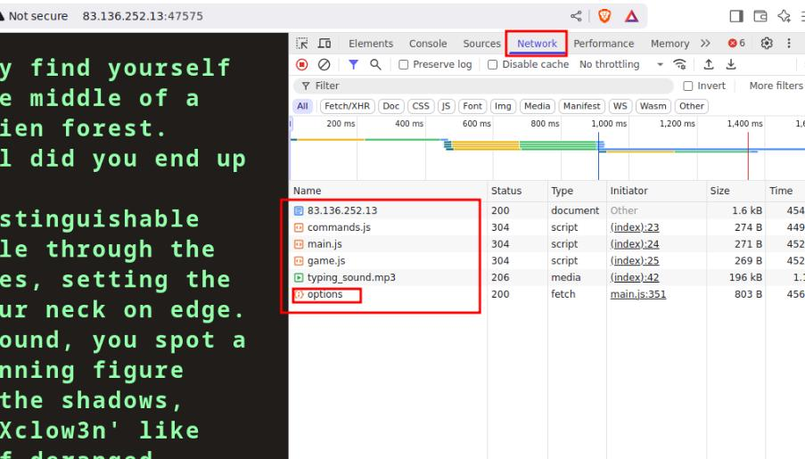
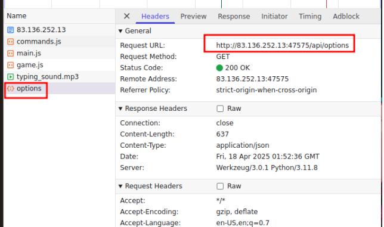

Si abrimos la direccion de la API en una nueva prestaña, encontramos comandos no listados anteriormente, incluyendo un **comando secreto**:

```text
"secret": [
  "Blip-blop, in a pickle with a hiccup! Shmiggity-shmack"
]
```

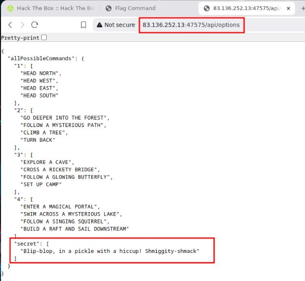

---

## 🔐 Paso 5: Usar el comando secreto

Volvemos a la consola del juego e introducimos el comando:

```bash
>> Blip-blop, in a pickle with a hiccup! Shmiggity-shmack
```

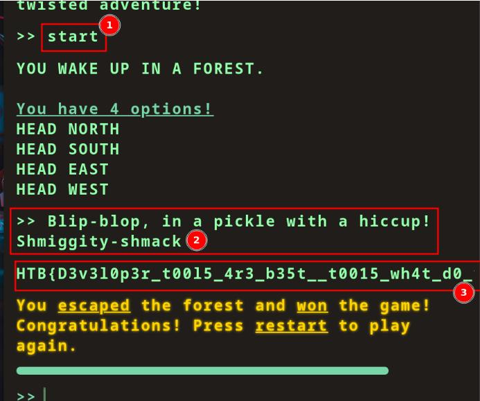

🎉 ¡Aparece un archivo nuevo en el panel de red llamado `monitor`! Dentro del `Preview` de su respuesta, encontramos la flag:

```bash
HTB{D3v310p3r_t0015_4z3_b35t__t0015_wh4t_de_y}
```

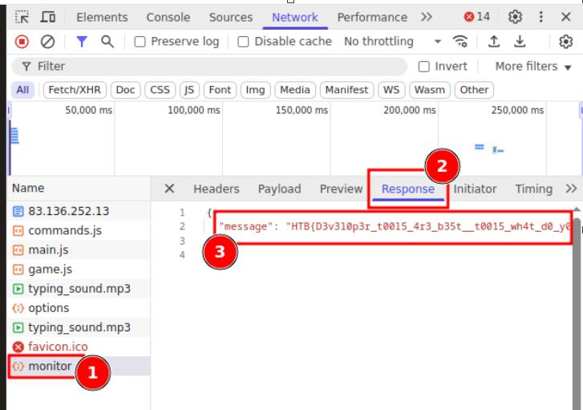

---

## 🧠 Lecciones aprendidas

- Siempre inspeccionar la red y el código fuente en retos tipo web.
- Las APIs a menudo contienen rutas, datos o comandos ocultos.
- En este caso, la flag solo podía obtenerse al descubrir e invocar un comando oculto.

---

## 🧰 Herramientas utilizadas

- Navegador + DevTools (F12)
- Curiosidad e intuición 🕵️‍♂️

---

## 📁 Recursos

- [Hack The Box](https://www.hackthebox.com/)

---

_Repositorio completo disponible en:_

👉 [GitHub - HTB Write-ups](https://github.com/LJara92/HackTheBox/tree/main)

