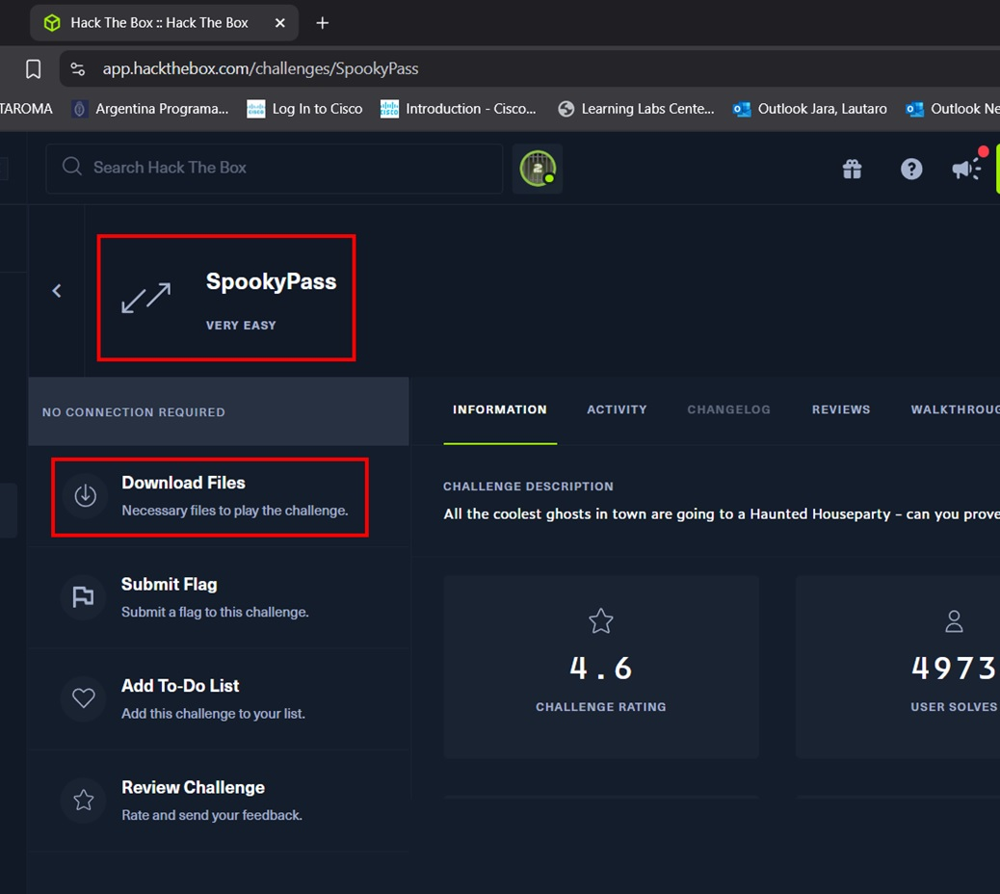
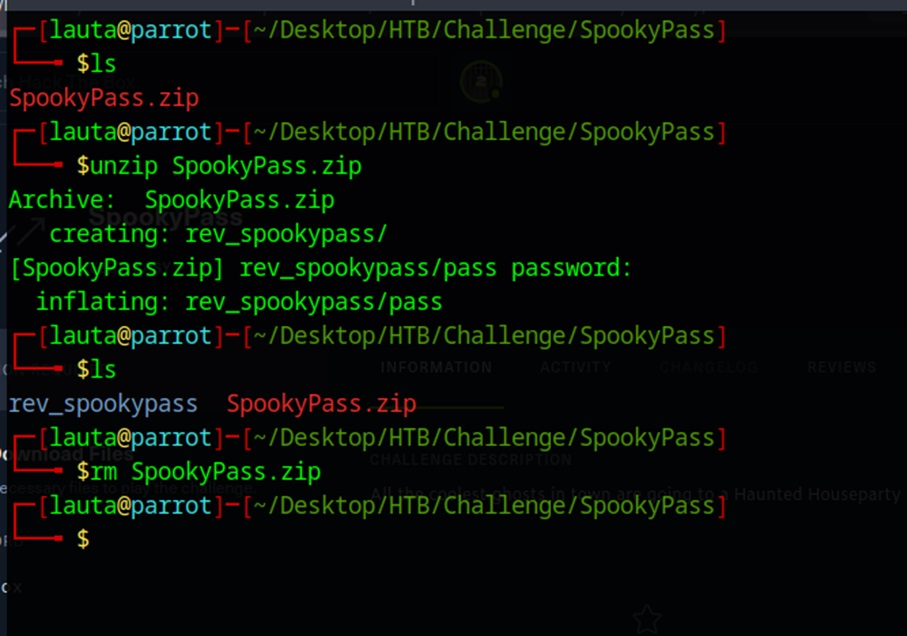
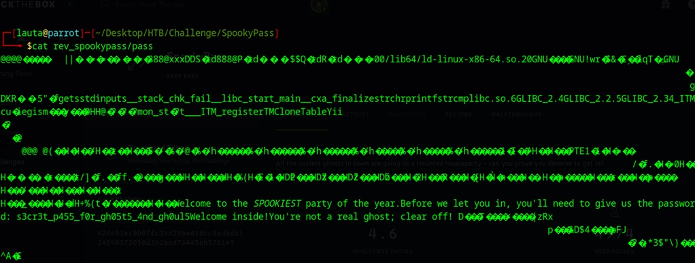
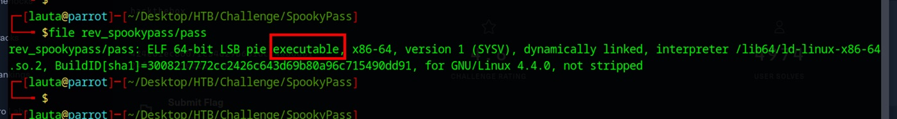
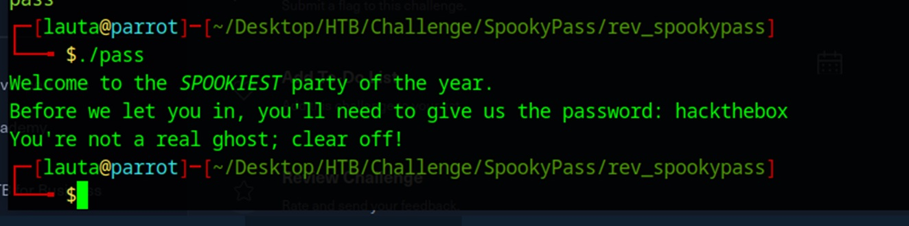

# 👻 Hack The Box Challenge: Spookypass

> _"All the coolest ghosts in town are going to a Haunted Houseparty - can you prove you deserve to get in?"_

---

## 🎯 Descripción del reto

En este reto del tipo *reversing*, se nos proporciona un binario para analizar. El objetivo es simple: **descubrir la contraseña correcta para poder acceder**.

---

## 📦 Paso 1: Descarga y extracción del archivo

Comenzamos descargando y descomprimiendo el archivo proporcionado por HTB:

```bash
unzip Spookypass.zip
rm Spookypass.zip
```




---

## 🧪 Paso 2: Análisis inicial del binario

Primero intentamos leerlo con `cat`, pero evidentemente es un binario:

```bash
cat pass
```



Usamos `file` para identificar el tipo de archivo:

```bash
file pass
```



📌 Resultado:
```
Spookypass: ELF 64-bit LSB executable, x86-64, version 1 (SYSV)...
```

Intentamos ejecutarlo:

```bash
./pass
```

El binario solicita una contraseña. Probamos con `hackthebox` (vale la pena soñar 😅), pero no funciona.



---

## 🧵 Paso 3: LTRACE para depurar llamadas

Usamos `ltrace` para observar las llamadas de librería:

```bash
ltrace ./pass
```

Ingresamos de nuevo `hackthebox` y observamos esto:

![Intentamos con ltrace(Imagenes/Imagen6.jpg)

```
strcmp("hackthebox", "s3cr3t_p455_f0r_gh05t5_4an_gh0ul")
```

¡Tenemos algo interesante! 🎯

---

## 🤔 Paso 4: Verificamos si es la contraseña correcta

Probamos con la cadena observada:

```bash
./pass
# s3cr3t_p455_f0r_gh05t5_4an_gh0ul
```

Pero... no funciona. Algo falta

![Intentamos con ltrace(Imagenes/Imagen7.jpg)

---

## 🔍 Paso 5: Usamos `strings` para buscar texto embebido

Ejecutamos:

```bash
strings pass 
```
![Intentamos con ltrace(Imagenes/Imagen8.jpg)

```bash
strings pass | grep s3cr3t
```
![Intentamos con ltrace(Imagenes/Imagen8B.jpg)

Resultado:
```
s3cr3t_p455_f0r_gh05t5_4an_gh0ul5
```

👀 Notamos un pequeño detalle: ¡faltaba un **5** al final!

---

## ✅ Paso 6: Ingreso exitoso

Ejecutamos nuevamente:

```bash
./pass
# s3cr3t_p455_f0r_gh05t5_4an_gh0ul5
```

✅ Y ahora sí, accedemos con éxito. Desafío completado. 🎉


- [ltrace](https://linux.die.net/man/1/ltrace)
- [strings](https://linux.die.net/man/1/strings)

---
